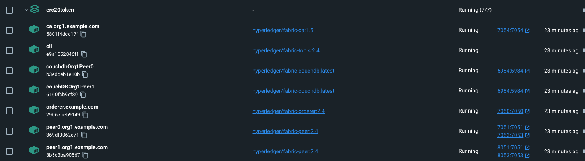
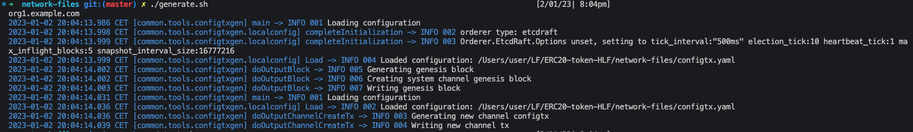
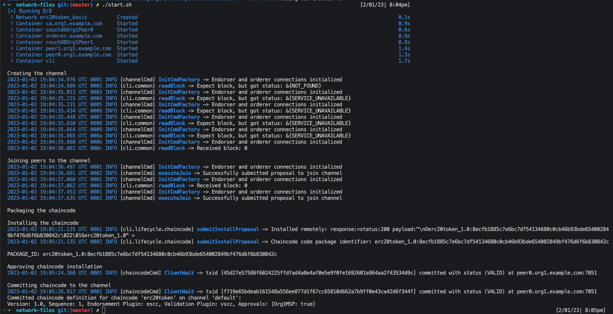
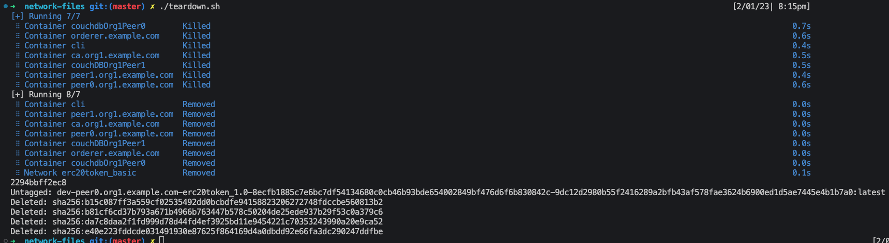
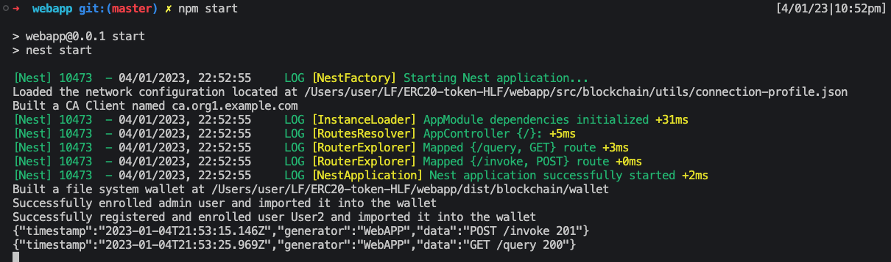
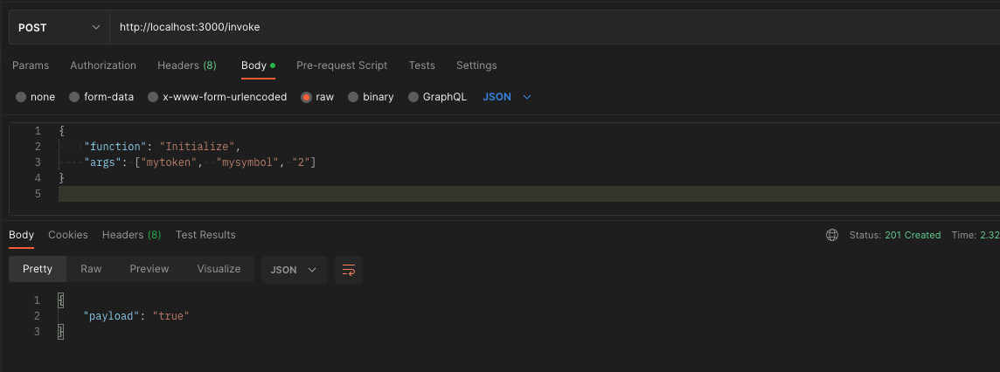
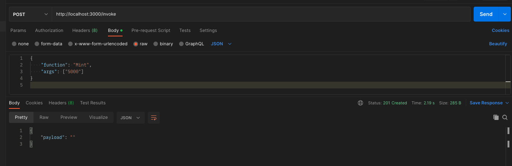
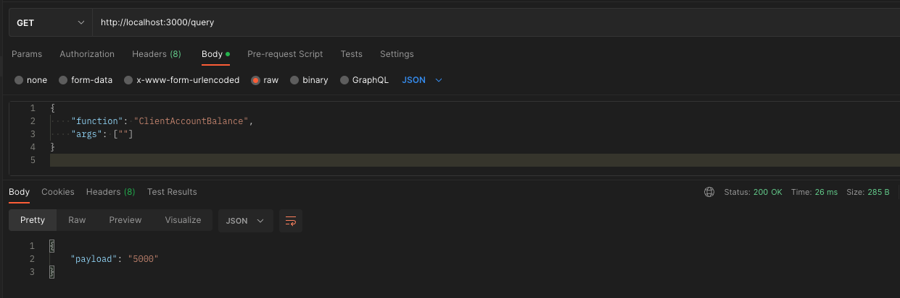

# Hyperledger-Fabric-basic-network
Basic network for a Hyperledger Fabric project development.

## Table of contents

- [Pre-requisites](#pre-requisites)
- [Hyperledger Fabric network](#hyperledger-fabric-network)
- [Deploy the network](#deploy-the-network)
  - [Manually test the chaincode](#manually-test-the-chaincode)
- [Web Application](#web-application)
  - [Installation](#installation)
  - [Running the app](#running-the-app)
    - [Fabric CA user creation](#fabric-ca-user-creation)
    - [Transactions](#transactions)

## Pre-requisites

1. Hyperledger Fabric v2.4
1. Hyperledger Fabric CA v1.5
1. Docker v20.10
1. Docker-Compose v2.14.0
1. Golang v1.19.4
1. NodeJS / TypeScript v16.13.0
1. npm v9.2.0

> Note: This has been developed using macOS, other OS have not been tested.

## Hyperledger Fabric network

The Hyperledger Fabric network consists of: 
* One orderer
    * orderer.example.com
* One organization
    * MSPID: Org1MSP
    * Two peers:
        * peer0.org1.example.com
        * peer1.org1.example.com
    * One CouchDB state database deployment for each peer
    * Fabric CA
        * ca.org1.example.com 
* Fabric CLI



## Deploy the network

1. Install Hyperledger Fabric latest docker images and binaries.
    ```shell
    ./install-fabric.sh
    ```
    this will generate a `fabric-samples` folder inside the project directory.
    > Note: The `fabric-samples` folder is not needed, as we will only be using the downloaded Docker images to deploy the network

1. Generate the network artifacts.
    ```shell
    cd network-files
    ./generate.sh
    ```
    

1. Deploy the network.
    ```shell
    ./start.sh
    ```
    

1. Teardown the network
    ```shell
    ./teardown.sh
    ```
    
## Web Application

A Web Application is made available using **Nest.js**

```shell
cd webapp/
```

### Installation

```shell
npm install
```

### Running the app

```shell
npm start
```


### Using the Web Application

#### Transactions

Transactions can be submitted via the web application. The Nest.js webapp supports both invokes and queries to the blockchain.

The application listens on `localhost:3000` and has two endpoints:

* http://localhost:3000/invoke

  body:
  ```json
  {
      "function": "FunctionName",
      "args": ["list", "of", "arguments"]
  }
  ```

As mentioned before, this chaincode needs to be initialized in order to use it. Therefore, the `Initialize` function can be called via POSTMAN.


Furthermore, an `Invoke` can be made via POSTMAN to Mint some tokens


* http://localhost:3000/query

  body:
  ```json
  {
      "function": "FunctionName",
      "args": ["list", "of", "arguments"]
  }
  ```
  Similarly, a `Query` can be made via POSTMAN to get the account balance

